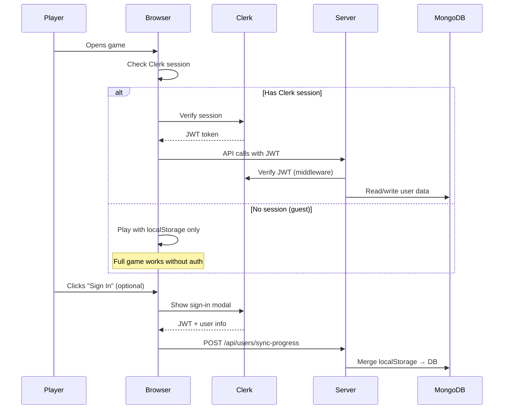
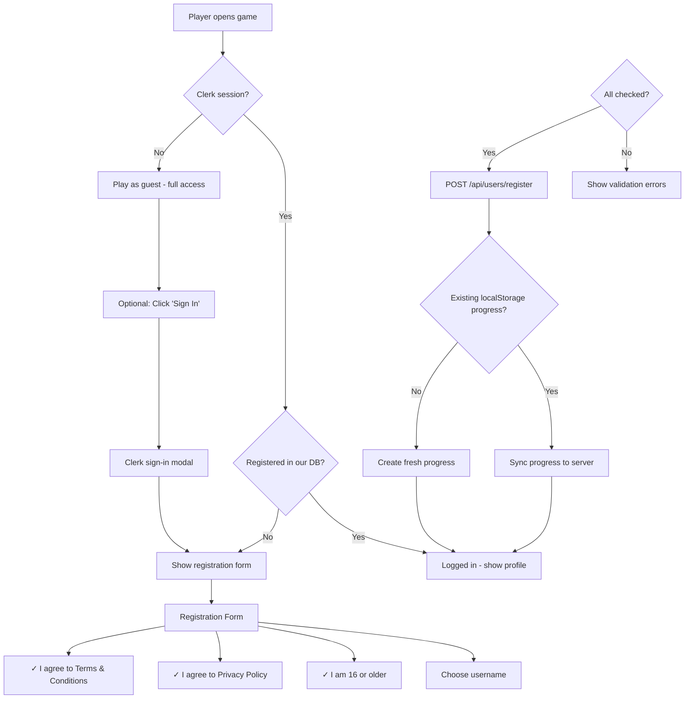

# Optional User Registration System — Specification & Implementation Plan

## Overview

Design and implement an optional user account system for VerseBattles (Demon Chase) using **Clerk.js** for authentication and **MongoDB** for persistent user data. Players can play without registering. Registered users gain progress tracking across devices, the ability to create/share worlds, and eventually social features.

> [!IMPORTANT]
> **Core principle**: Registration is never required to play. The game must work fully offline/anonymous. Clerk.js auth is an optional enhancement layer on top of the existing guest experience.

---

## Current State Analysis

### What Exists Today

| Component            | Current State                                                                              |
| -------------------- | ------------------------------------------------------------------------------------------ |
| **Authentication**   | In-memory `RoomManager.js` — ephemeral session tokens, lost on server restart              |
| **Progress storage** | `ProgressManager.js` — localStorage only (missions, stars, XP)                             |
| **User identity**    | Username-only registration via `/api/register`, no persistence                             |
| **Network layer**    | `Network.js` (Socket.IO) + `LocalNetwork.js` (offline engine)                              |
| **Worlds/Maps**      | 5 procedural map generators in `src/shared/map-generators/`, 3 chapters in `chapters.json` |
| **Database**         | MongoDB via Mongoose (3 models: `VerseSong`, `Sermon`, `CategoryStyle`)                    |
| **Offline support**  | PWA service worker, `LocalNetwork.js` drives local `GameEngine`                            |
| **Content scripts**  | 42 scripts in `scripts/` for content generation (quizzes, songs, verses)                   |

### Key Integration Points

- `server.js` — Express routes + Socket.IO handlers (will add Clerk middleware)
- `RoomManager.js` — In-memory user/room management (will bridge to Clerk users)
- `ProgressManager.js` — localStorage progress (will add server sync)
- `lobby.html` — Login/room UI (will add Clerk sign-in component)
- `game.js` — Main game client (will add auth awareness)
- `service-worker.js` — Cache management (will add new client modules)

---

## Architecture

### Authentication Flow



### Data Flow — Online vs Offline

```
ONLINE (Authenticated):
  Game Events → SyncManager → REST API → MongoDB
                    ↓
              localStorage (local cache)

ONLINE (Guest):
  Game Events → ProgressManager → localStorage only

OFFLINE (Any user):
  Game Events → ProgressManager → localStorage
                    ↓
              SyncManager queues for later sync
              (when back online, if authenticated)
```

---

## User Review Required

> [!IMPORTANT]
> **Clerk.js Plan Selection**: Clerk has a free tier (10,000 monthly active users). For this game, the free tier should be sufficient to start. We'll need a Clerk project set up at [clerk.com](https://clerk.com) and the publishable key + secret key added to `.env`.

> [!WARNING]
> **Privacy & Terms Pages**: The spec includes age verification (16+), privacy policy acceptance, and terms acceptance as part of registration. **You will need to provide actual privacy policy and terms of service content** — the implementation will create placeholder pages that need real legal text.

> [!IMPORTANT]
> **World Sharing & Content Generation**: The spec proposes that world creators can use the existing `generate_content.js` and map generator scripts to generate content for their worlds. This means world creators effectively run server-side scripts. The initial implementation will limit world creation to admin users, with a self-service world builder as a future extension.

---

## MongoDB Schema Design

### 1. User Collection

```javascript
// src/server/models/User.js [NEW]
const UserSchema = new Schema(
  {
    clerkId: { type: String, required: true, unique: true, index: true },
    username: { type: String, required: true, unique: true, index: true },
    displayName: String,
    email: String, // From Clerk, for account recovery
    avatarUrl: String, // From Clerk profile

    // Consent tracking
    agreedToTerms: { type: Boolean, required: true },
    agreedToPrivacy: { type: Boolean, required: true },
    ageVerified: { type: Boolean, required: true }, // Confirmed ≥16
    consentDate: { type: Date, required: true },

    // Game profile
    totalXP: { type: Number, default: 0 },
    gamesPlayed: { type: Number, default: 0 },
    totalPlayTime: { type: Number, default: 0 }, // seconds

    // World creation
    worldsCreated: [{ type: Schema.Types.ObjectId, ref: "World" }],
    worldsJoined: [{ type: Schema.Types.ObjectId, ref: "World" }],

    // Status
    status: {
      type: String,
      enum: ["active", "suspended", "deleted"],
      default: "active",
    },
    lastLoginAt: Date,

    createdAt: { type: Date, default: Date.now },
    updatedAt: { type: Date, default: Date.now },
  },
  { timestamps: true },
);
```

### 2. PlayerProgress Collection

```javascript
// src/server/models/PlayerProgress.js [NEW]
const PlayerProgressSchema = new Schema(
  {
    userId: {
      type: Schema.Types.ObjectId,
      ref: "User",
      required: true,
      index: true,
    },

    // Mission progress (mirrors ProgressManager localStorage structure)
    completedMissions: [String],
    currentWorldId: { type: String, default: "chapter1" },
    unlockedWorlds: [String],
    missionStars: { type: Map, of: Number }, // missionId → stars (1-3)

    // Verse learning progress
    versesLearned: [String], // verse references mastered
    verseAttempts: { type: Map, of: Number }, // verseRef → attempt count
    dailyChallengeStreak: { type: Number, default: 0 },
    lastDailyChallengeDate: String,

    // Game stats
    totalXP: { type: Number, default: 0 },
    highestLevel: { type: Number, default: 1 },
    monstersDefeated: { type: Number, default: 0 },

    // Sync metadata
    lastSyncedAt: Date,
    syncVersion: { type: Number, default: 0 }, // Optimistic concurrency

    createdAt: { type: Date, default: Date.now },
    updatedAt: { type: Date, default: Date.now },
  },
  { timestamps: true },
);

PlayerProgressSchema.index({ userId: 1 }, { unique: true });
```

### 3. World Collection

```javascript
// src/server/models/World.js [NEW]
const WorldSchema = new Schema(
  {
    slug: { type: String, required: true, unique: true, index: true },
    name: { type: String, required: true },
    description: String,

    // Author
    authorId: { type: Schema.Types.ObjectId, ref: "User", required: true },
    authorUsername: String,

    // Visibility & sharing
    visibility: {
      type: String,
      enum: ["private", "unlisted", "public"],
      default: "private",
    },
    shareCode: { type: String, unique: true, sparse: true }, // Short code for sharing

    // Content
    chapters: [
      {
        id: String,
        name: String,
        description: String,
        nodeShape: {
          type: String,
          enum: ["shield", "heart", "sword", "star", "cross"],
        },
        theme: String,
        missionIds: [String],
        unlockRequirement: {
          chapterId: String,
          missionsCompleted: Number,
        },
      },
    ],

    // Missions stored inline (for user-created worlds)
    missions: [
      {
        id: String,
        name: String,
        description: String,
        difficulty: String,
        category: String,
        mapStyle: String,
        spawnRate: Number,
        monsterTypes: [String],
        objectives: Schema.Types.Mixed,
        customVerses: [Schema.Types.Mixed], // Optional custom verse sets
      },
    ],

    // Map data
    mapIds: [{ type: Schema.Types.ObjectId, ref: "WorldMap" }],

    // Stats
    playCount: { type: Number, default: 0 },
    playerCount: { type: Number, default: 0 }, // Unique players
    rating: { type: Number, default: 0 },
    ratingCount: { type: Number, default: 0 },

    // Settings
    maxPlayers: { type: Number, default: 4 },
    gameMode: { type: String, default: "mission" },

    // External Incentives (for Pastors/Parents)
    externalRewards: [
      {
        title: { type: String, required: true }, // e.g., "Pizza Night"
        description: String,
        requirement: {
          type: {
            type: String,
            enum: ["xp", "missions", "stars", "verses"],
            required: true,
          },
          value: { type: Number, required: true }, // e.g., 5000 XP or 10 Missions
          worldId: String, // Optional: specific to a chapter
        },
        status: {
          type: String,
          enum: ["active", "archived"],
          default: "active",
        },
      },
    ],

    // Status
    status: {
      type: String,
      enum: ["draft", "published", "archived"],
      default: "draft",
    },

    createdAt: { type: Date, default: Date.now },
    updatedAt: { type: Date, default: Date.now },
  },
  { timestamps: true },
);
```

### 4. WorldMap Collection

```javascript
// src/server/models/WorldMap.js [NEW]
const WorldMapSchema = new Schema(
  {
    worldId: {
      type: Schema.Types.ObjectId,
      ref: "World",
      required: true,
      index: true,
    },
    missionId: String, // Which mission this map belongs to
    name: String,

    // Map generation parameters (so maps can be regenerated)
    generatorType: {
      type: String,
      enum: ["classic", "narrow", "labyrinth", "open", "city", "custom"],
      required: true,
    },
    seed: Number, // For deterministic regeneration
    parameters: {
      // Generator-specific parameters
      streetSpacing: Number,
      roadWidth: Number,
      buildingDensity: Number,
      wallDensity: Number,
    },

    // Pre-generated map data (optional, for custom maps)
    wallData: Schema.Types.Mixed, // Stored wall array for custom maps
    terrainData: Schema.Types.Mixed, // Terrain decorations

    // Metadata
    width: Number, // World width in pixels
    height: Number, // World height in pixels

    createdAt: { type: Date, default: Date.now },
  },
  { timestamps: true },
);
```

---

## REST API Design

### Authentication Endpoints

All authenticated endpoints use Clerk JWT verification middleware.

```
POST   /api/users/register          — Complete registration (consent, username, age)
GET    /api/users/me                — Get current user profile
PATCH  /api/users/me                — Update profile (display name, avatar)
DELETE /api/users/me                — Delete account (GDPR)
```

### Progress Sync Endpoints

```
GET    /api/progress                — Get server-side progress
POST   /api/progress/sync           — Sync localStorage → server (merge strategy)
```

### World Endpoints

```
GET    /api/worlds                  — List public/joined worlds
GET    /api/worlds/:slug            — Get world details
POST   /api/worlds                  — Create new world (authenticated)
PATCH  /api/worlds/:slug            — Update world (author only)
DELETE /api/worlds/:slug            — Delete world (author only)
POST   /api/worlds/:slug/join       — Join a world by slug
GET    /api/worlds/share/:code      — Lookup world by share code
POST   /api/worlds/:slug/maps       — Add/generate a map for a mission
GET    /api/worlds/:slug/maps/:missionId — Get map data for a mission
```

---

## Client-Side Architecture

### New Modules

#### 1. AuthManager (`src/client/AuthManager.js`) [NEW]

Wraps Clerk.js frontend SDK. Manages auth state and exposes it to the rest of the game.

```javascript
class AuthManager {
  constructor() {
    this.clerk = null;
    this.user = null; // Clerk user object
    this.dbUser = null; // Our MongoDB user
    this.isAuthenticated = false;
    this.isRegistered = false; // Has completed our registration (consent etc.)
  }

  async init() {} // Load Clerk, check session
  async signIn() {} // Show Clerk sign-in modal
  async signOut() {} // Sign out
  async completeRegistration(data) {} // POST /api/users/register
  getToken() {} // Get JWT for API calls
  onAuthChange(callback) {} // Auth state change listener
}
```

#### 2. SyncManager (`src/client/SyncManager.js`) [NEW]

Handles bidirectional sync between localStorage and MongoDB. Queues changes when offline.

```javascript
class SyncManager {
  constructor(authManager, progressManager) {}

  async syncToServer() {} // Push localStorage → MongoDB
  async syncFromServer() {} // Pull MongoDB → localStorage
  async fullSync() {} // Bidirectional merge (latest wins)
  queueChange(change) {} // Queue for offline sync
  async flushQueue() {} // Send queued changes when online
  isOnline() {} // Check connectivity
  onSyncComplete(callback) {}
}
```

#### 3. WorldBrowser (`src/client/WorldBrowser.js`) [NEW]

UI component for browsing, joining, and managing worlds.

```javascript
class WorldBrowser {
  constructor(authManager) {}

  async loadPublicWorlds() {}
  async loadMyWorlds() {}
  async joinWorld(slug) {}
  async joinByShareCode(code) {}
  renderWorldList(container) {}
  renderWorldDetail(world, container) {}
}
```

### Modified Modules

#### `ProgressManager.js` — Add sync hooks

```diff
 class ProgressManager {
+    setSyncManager(syncManager) { }  // Wire up sync
     completeMission(missionId, stars, xpEarned) {
         // ... existing localStorage save ...
+        if (this._syncManager) {
+            this._syncManager.queueChange({
+                type: 'missionComplete',
+                missionId, stars, xpEarned,
+                timestamp: Date.now()
+            });
+        }
     }
 }
```

#### `game.js` — Auth awareness

```diff
 // At startup, check auth state
+if (window.authManager && window.authManager.isAuthenticated) {
+    // Show "Signed in as X" in UI
+    // Enable world browser in menu
+}

 // Game over / level complete — sync progress
+if (window.syncManager) {
+    window.syncManager.syncToServer().catch(console.warn);
+}
```

---

## Registration Flow

### UI Flow



### Registration Form Fields

| Field              | Type            | Required | Validation                                     |
| ------------------ | --------------- | -------- | ---------------------------------------------- |
| Username           | Text input      | Yes      | 3-20 chars, alphanumeric + underscores, unique |
| Age confirmation   | Checkbox        | Yes      | Must confirm ≥ 16 years old                    |
| Privacy Policy     | Checkbox + link | Yes      | Must accept                                    |
| Terms & Conditions | Checkbox + link | Yes      | Must accept                                    |

---

## Offline Graceful Degradation

### Strategy

The game already has a working offline mode via `LocalNetwork.js` + service worker. The user system adds a **sync layer** that degrades gracefully:

| Feature               | Online + Authenticated    | Online + Guest         | Offline                |
| --------------------- | ------------------------- | ---------------------- | ---------------------- |
| **Play solo**         | ✅ Full                   | ✅ Full                | ✅ Full (LocalNetwork) |
| **Play multiplayer**  | ✅                        | ✅ (ephemeral session) | ❌ Not available       |
| **Progress tracking** | ✅ localStorage + MongoDB | ✅ localStorage only   | ✅ localStorage only   |
| **World browsing**    | ✅                        | ✅ Read-only           | ❌ Cached worlds only  |
| **World creation**    | ✅                        | ❌                     | ❌                     |
| **Cross-device sync** | ✅                        | ❌                     | ❌ (syncs when online) |
| **Share worlds**      | ✅                        | ❌                     | ❌                     |

### SyncManager Offline Queue

```javascript
// When offline, changes are queued in localStorage
const SYNC_QUEUE_KEY = "syncQueue";

// On reconnection:
window.addEventListener("online", () => {
  if (window.syncManager && window.authManager.isAuthenticated) {
    syncManager.flushQueue();
  }
});
```

### Service Worker Updates

Add new client modules to the cache list in `service-worker.js`:

```diff
 var CORE_ASSETS = [
     // ... existing assets ...
+    '/src/client/AuthManager.js',
+    '/src/client/SyncManager.js',
+    '/src/client/WorldBrowser.js',
 ];
```

---

## World Creation & Sharing System

### World Creation Flow

1. **Authenticated user** clicks "Create World" in the world browser
2. Fills in world name, description, visibility
3. Adds chapters with missions (UI form)
4. For each mission, selects:
   - Map style (from existing 5 generators)
   - Difficulty preset
   - Verse category
   - Optional custom verses
5. Server generates map data using existing `MapGeneratorFactory`
6. World is saved to MongoDB with generated maps
7. If `public` or `unlisted`, a share code is generated

### Integration with Existing Scripts

The existing content generation scripts can be used to populate custom worlds:

- `generate_content.js` — Generate custom verse sets for world missions
- `generate_ai_quizzes.js` — Generate AI-powered quiz content
- Map generators (`ClassicMaze`, `NarrowPaths`, `ComplexLabyrinth`, `OpenPlains`, `GridCity`) — Generate map data stored in `WorldMap` collection

Initially, world creation with generated content will be **admin-only** (via scripts). The self-service world builder UI is a future extension.

### Sharing

- **Share code**: Short 8-character alphanumeric code (e.g., `FAITH42X`)
- **Share URL**: `https://versebattles.com/world/FAITH42X`
- **Share mechanics**: Code + URL, shareable via clipboard/social

---

## Single Player & Multiplayer Compatibility

### Solo Play

- Works exactly as today (LocalNetwork or Network + startSoloGame)
- Auth is optional — `AuthManager` checks if Clerk is loaded; if not, skips silently
- Progress saved to localStorage always; synced to MongoDB if authenticated

### Multiplayer

- Current `RoomManager.js` ephemeral sessions continue to work for guests
- Authenticated users get their `clerkId` attached to the room session
- World-based multiplayer: authenticated users can create rooms within their worlds
- The existing `lobby.html` flow is extended, not replaced

```diff
 // In RoomManager.js
 registerUser(username) {
+    // Check if this is a Clerk-authenticated user
+    // If so, link to MongoDB User record
+    // If not, continue with ephemeral session (existing behavior)
 }
```

---

## Proposed Extensions

### Extension 1: Social Features

- **Friend list**: Add friends by username or share code
- **Activity feed**: See friends' progress, world creations
- **Leaderboards**: Global and friend-based XP rankings
- **Chat**: In-game text chat during multiplayer sessions

### Extension 2: World Editor UI

- **Visual map editor**: Drag-and-drop map builder in the browser
- **Mission designer**: UI for configuring mission objectives, monster types, verse sets
- **Preview mode**: Test-play a world before publishing
- **Templates**: Pre-built world templates to start from

### Extension 3: Content Marketplace

- **Browse worlds**: Public directory of user-created worlds with ratings
- **Featured worlds**: Staff-curated world highlights
- **Rating system**: Players rate worlds 1-5 stars after playing
- **Collections**: Curated lists of worlds by theme/difficulty

### Extension 4: Church & Group Features

- **Church groups**: Create a group for a church/youth group
- **Group worlds**: Shared worlds visible only to group members
- **Leader dashboard**: Track group member progress
- **Custom content**: Upload church-specific devotionals/verses
- **Event worlds**: Time-limited worlds for special events

### Extension 5: Achievement System

- **Badges**: Earn badges for milestones (first world created, 100 monsters defeated, etc.)
- **Titles**: Unlock display titles (e.g., "Demon Slayer", "Scripture Scholar")
- **Progress tiers**: Bronze → Silver → Gold → Platinum progression
- **Badge display**: Show on profile and in multiplayer lobbies

### Extension 6: Analytics Dashboard

- **Player insights**: Verse retention rates, play patterns, strength/weakness areas
- **World analytics**: For world creators — play counts, completion rates, problem spots
- **Aggregate data**: Anonymous aggregate learning analytics for researchers/churches
- **Export**: Download personal data as CSV (GDPR compliance)

---

## Proposed Changes — File-by-File

### Server — New Files

---

#### [NEW] [User.js](file:///home/michael/proj/dcgame/src/server/models/User.js)

Mongoose model for registered users (clerkId, username, consent, XP, worlds).

#### [NEW] [PlayerProgress.js](file:///home/michael/proj/dcgame/src/server/models/PlayerProgress.js)

Mongoose model for server-side progress (mirrors ProgressManager localStorage shape).

#### [NEW] [World.js](file:///home/michael/proj/dcgame/src/server/models/World.js)

Mongoose model for user-created worlds with chapters, missions, visibility.

#### [NEW] [WorldMap.js](file:///home/michael/proj/dcgame/src/server/models/WorldMap.js)

Mongoose model for generated/custom map data associated with world missions.

#### [NEW] [users.js](file:///home/michael/proj/dcgame/src/server/routes/users.js)

Express routes: register, profile, delete account.

#### [NEW] [progress.js](file:///home/michael/proj/dcgame/src/server/routes/progress.js)

Express routes: get progress, sync progress.

#### [NEW] [worlds.js](file:///home/michael/proj/dcgame/src/server/routes/worlds.js)

Express routes: CRUD worlds, join, share, generate maps.

#### [NEW] [clerkAuth.js](file:///home/michael/proj/dcgame/src/server/middleware/clerkAuth.js)

Express middleware to verify Clerk JWT tokens on protected routes.

### Client — New Files

---

#### [NEW] [AuthManager.js](file:///home/michael/proj/dcgame/src/client/AuthManager.js)

Client-side auth wrapper for Clerk.js frontend SDK.

#### [NEW] [SyncManager.js](file:///home/michael/proj/dcgame/src/client/SyncManager.js)

Bidirectional localStorage ↔ MongoDB sync with offline queue.

#### [NEW] [WorldBrowser.js](file:///home/michael/proj/dcgame/src/client/WorldBrowser.js)

UI component for browsing and managing worlds.

### Existing Files — Modifications

---

#### [MODIFY] [server.js](file:///home/michael/proj/dcgame/server.js)

- Add Clerk SDK initialization
- Mount new route handlers (`users`, `progress`, `worlds`)
- Add Clerk webhook endpoint for user sync

#### [MODIFY] [ProgressManager.js](file:///home/michael/proj/dcgame/src/client/ProgressManager.js)

- Add `setSyncManager()` hook
- Queue sync events on `completeMission()`, `unlockWorld()`, etc.

#### [MODIFY] [index.html](file:///home/michael/proj/dcgame/index.html)

- Add Clerk.js frontend SDK script tag
- Add sign-in/sign-out button to main menu
- Add registration modal (consent form)
- Add world browser modal

#### [MODIFY] [lobby.html](file:///home/michael/proj/dcgame/lobby.html)

- Replace ephemeral registration with optional Clerk sign-in
- Allow guest play without registration
- Add world selection to room creation

#### [MODIFY] [game.js](file:///home/michael/proj/dcgame/game.js)

- Initialize `AuthManager` on load
- Wire `SyncManager` to `ProgressManager`
- Sync progress on game over / level complete
- Show auth status in UI

#### [MODIFY] [service-worker.js](file:///home/michael/proj/dcgame/service-worker.js)

- Add new client modules to cache list

#### [MODIFY] [.env.example](file:///home/michael/proj/dcgame/.env.example)

- Add `CLERK_PUBLISHABLE_KEY` and `CLERK_SECRET_KEY` placeholders

#### [MODIFY] [package.json](file:///home/michael/proj/dcgame/package.json)

- Add `@clerk/backend` dependency

### Static Pages — New Files

---

#### [NEW] [privacy.html](file:///home/michael/proj/dcgame/privacy.html)

Privacy policy page (placeholder content — needs real legal text).

#### [NEW] [terms.html](file:///home/michael/proj/dcgame/terms.html)

Terms & conditions page (placeholder content — needs real legal text).

---

## Verification Plan

### Automated Tests

#### 1. User Model & Routes Tests

**File**: `test/test-user-system.js` [NEW]

**Run**: `node test/test-user-system.js`

Tests:

- User model validation (required fields, unique constraints)
- Registration endpoint with mock Clerk JWT
- Progress sync endpoint (merge strategy)
- World CRUD endpoints
- Share code generation and lookup
- Age verification enforcement (reject < 16)

#### 2. Existing Test Suite — Regression

**Run**: `node test/test-game-engine.js && node test/test-local-network.js && node test/test-shared-modules.js`

Verify that auth changes don't break existing game logic.

### Manual Verification

> [!NOTE]
> Some features (Clerk sign-in modal, offline degradation) require manual testing in a browser. Below are steps to verify key flows.

#### Manual Test 1: Guest Play (No Registration)

1. Start the server: `./restart-server.sh`
2. Open `http://localhost:3500` in a browser
3. Click "Play" without signing in
4. Verify the game starts normally in solo mode
5. Complete a level and verify progress saves to localStorage
6. Refresh the page — progress should persist from localStorage

#### Manual Test 2: Registration Flow

1. Click "Sign In" → Clerk modal should appear
2. Sign in with a test account
3. Registration form should appear with:
   - Username field
   - "I am 16 or older" checkbox
   - "I agree to Privacy Policy" checkbox (with link)
   - "I agree to Terms & Conditions" checkbox (with link)
4. Try submitting without checking all boxes → validation error
5. Fill in all fields and submit → should succeed
6. Verify user appears in MongoDB `users` collection

#### Manual Test 3: Progress Sync

1. Sign in as a registered user
2. Play a game, complete a mission
3. Open browser DevTools → Application → localStorage — progress should be saved
4. Open a different browser (or incognito with same Clerk session)
5. Sign in → progress should sync from server → same missions completed

#### Manual Test 4: Offline Degradation

1. Sign in and start a game
2. Open DevTools → Network → check "Offline"
3. Game should continue working (LocalNetwork mode)
4. Complete a mission → should save to localStorage + queue for sync
5. Uncheck "Offline"
6. Wait a few seconds → queued changes should sync to server
7. Check MongoDB to confirm changes arrived

#### Manual Test 5: World Browsing

1. Sign in as a registered user
2. Open the world browser from the game menu
3. Browse public worlds (if any exist)
4. Join a world via share code
5. Start a mission within the world

> [!TIP]
> Since Clerk requires a real Clerk project setup, the first implementation step should be creating a Clerk test project and adding the keys to `.env`. I recommend doing this before working on the code. You can create a free Clerk project at https://dashboard.clerk.com/.
