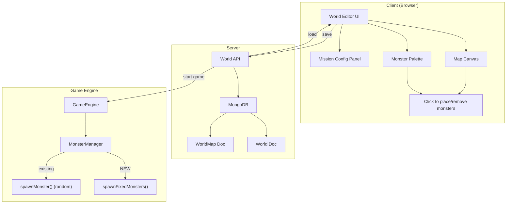
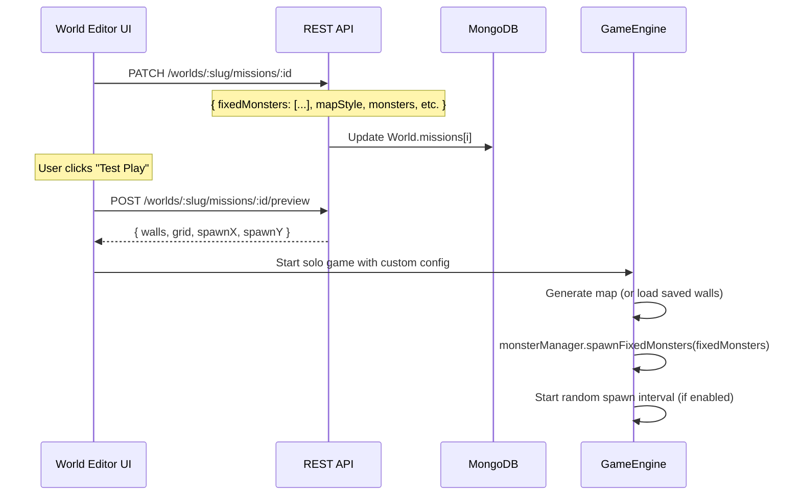

# World Editor System — Design Document

Design for a visual world/mission editor that allows users to **create worlds**, **place specific monsters** at specific map locations with custom strengths, and **edit** those worlds after creation.

> [!NOTE]
> This is a **design only** — no implementation yet.

---

## How It Works Today

```
Mission JSON → missionLoader.js → GameConfig → GameEngine
                                                  ↓
                                          MonsterManager.spawnMonster()
                                          picks random type from missions[].monsters[]
                                          picks random position from grid
```

**Key limitations**:

- Monsters spawn at **random** valid positions — no fixed placements
- Monster types are drawn randomly from the mission's `monsters[]` array — no control over which type spawns where
- No per-monster stat overrides (health, damage, speed, behavior)
- Map is generated procedurally and discarded — no persistence of specific layouts

---

## Architecture Overview



---

## Data Model Extensions

### Mission Schema — `fixedMonsters` field

Add to the existing `missions[]` array inside the World model:

```javascript
// Inside World.missions[] subdocument
{
  id: String,
  name: String,
  // ... existing fields (mapStyle, monsters, maxMonsters, etc.) ...

  // NEW: Fixed monster placements (editor-placed)
  fixedMonsters: [{
    x: Number,                    // Pixel position on map
    y: Number,
    demonType: String,            // One of the 18 types (Fear, Pride, etc.)
    behavior: {
      type: String,               // 'chaser' | 'patrol' | 'guard' | 'wanderer'
      patrolRadius: Number,       // pixels (for patrol/guard)
      patrolPath: [{x: Number, y: Number}], // optional waypoints
    },
    stats: {
      healthMultiplier: Number,   // default 1.0, e.g. 2.0 = double HP
      damageMultiplier: Number,   // default 1.0
      speedMultiplier: Number,    // default 1.0
    },
    spawnTrigger: {
      type: String,               // 'immediate' | 'proximity' | 'timer' | 'killCount'
      value: Number,              // proximity: pixels, timer: seconds, killCount: N
    },
    isBoss: Boolean,              // Larger sprite, boss health bar
    label: String,                // Optional display name override
  }],

  // NEW: Whether to ALSO spawn random monsters alongside fixed ones
  randomSpawnsEnabled: { type: Boolean, default: true },
  randomSpawnBudget: Number,    // If set, cap random spawns at this count
}
```

### WorldMap — `customWalls` field

The existing `WorldMap` model has `wallData` and `generatorType`. Add support for manual wall edits on top of a generated map:

```javascript
{
  // ... existing fields ...
  customWalls: [{              // Editor-added walls (on top of generated map)
    x: Number, y: Number,
    width: Number, height: Number
  }],
  removedWalls: [{             // Editor-removed walls (holes in generated map)
    x: Number, y: Number,
    width: Number, height: Number
  }],
  playerSpawn: { x: Number, y: Number }  // Override default spawn
}
```

---

## Monster Type Reference

All 18 demon types and their ability groups, available in the editor palette:

| Group           | Demons                                     | Special Ability                     |
| --------------- | ------------------------------------------ | ----------------------------------- |
| **Paralyzers**  | Fear, Doubt, Depression, Despair           | Freeze aura (40% slow within 150px) |
| **Misleaders**  | Confusion, Deception, Ignorance, Blindness | Erratic zig-zag movement            |
| **Strongholds** | Pride, Condemnation, Unbelief              | 2× HP, Pride has 3-hit armor        |
| **Thieves**     | Poverty, Temptation, Shame                 | Drain XP/ammo on hit (40% chance)   |
| **Aggressors**  | Strife                                     | Dash attack (3× speed bursts)       |
| **Other**       | Infirmity, Slumber, Jezebel, Swarm         | Standard behavior, varying damage   |

**Per-type damage** (from `DEMON_MAX_DAMAGE`): Jezebel (8) > Infirmity (7) > Pride/Strife (6) > Unbelief/Temptation/Swarm (5) > Confusion/Deception/Doubt/Despair (4) > Fear/Depression/Poverty/Shame (3) > others (2)

---

## Engine Modifications

### MonsterManager — `spawnFixedMonsters(fixedMonsters)`

New method that iterates the `fixedMonsters` array and creates monsters at exact positions with custom stats:

```javascript
spawnFixedMonsters(fixedMonsters) {
    for (const fm of fixedMonsters) {
        if (fm.spawnTrigger?.type !== 'immediate') {
            // Queue for delayed spawn
            this._pendingSpawns.push(fm);
            continue;
        }
        this._spawnFixed(fm);
    }
}

_spawnFixed(fm) {
    const baseHealth = 10 + (this.gameState.gameLevel - 1) * 5;
    const hpMult = (fm.stats?.healthMultiplier || 1.0)
        * (Constants.STRONGHOLD_DEMONS.includes(fm.demonType) ? Constants.STRONGHOLD_HP_MULTIPLIER : 1.0);

    const monster = this._createMonster(fm.x, fm.y, fm.behavior?.type === 'chaser', baseHealth, hpMult, fm.demonType);

    // Apply custom overrides
    if (fm.stats?.damageMultiplier) monster.maxDamage = Math.round(monster.maxDamage * fm.stats.damageMultiplier);
    if (fm.stats?.speedMultiplier) monster.speedMultiplier = fm.stats.speedMultiplier;
    if (fm.isBoss) { monster.isBoss = true; monster.width *= 1.5; monster.height *= 1.5; }
    if (fm.label) monster.label = fm.label;
    if (fm.behavior?.patrolPath) monster.patrolPath = fm.behavior.patrolPath;

    this.gameState.monsters.push(monster);
}
```

### GameEngine — Load fixed monsters from mission config

When starting a mission, if `gameConfig.fixedMonsters` is present, call `spawnFixedMonsters()` before the regular spawn interval starts:

```javascript
// In GameEngine initialization
if (this.gameConfig.fixedMonsters) {
  this.monsterManager.spawnFixedMonsters(this.gameConfig.fixedMonsters);
}
```

### Spawn Triggers

For non-immediate spawn triggers, `MonsterManager.updateMonsters()` checks pending spawns each tick:

| Trigger     | Logic                                                                   |
| ----------- | ----------------------------------------------------------------------- |
| `immediate` | Spawned at game start                                                   |
| `proximity` | Spawned when any player is within `value` pixels of the placement point |
| `timer`     | Spawned after `value` seconds of game time                              |
| `killCount` | Spawned after N total monsters killed                                   |

---

## API Endpoints

All endpoints use the existing `requireAuth` middleware and world ownership checks.

```
GET    /api/worlds/:slug/editor           — Get world data in editor format
PATCH  /api/worlds/:slug/missions/:id     — Update a mission (including fixedMonsters)
POST   /api/worlds/:slug/missions/:id/preview — Generate map preview (returns wall data)
```

The existing `PATCH /api/worlds/:slug` and mission routes already handle most CRUD. The new endpoints above are editor-specific additions.

---

## Client UI — World Editor

### Component Structure

```
WorldEditor.js (main controller)
├── MapCanvas.js       — 2D canvas rendering of walls + placed monsters
├── MonsterPalette.js  — Draggable demon type selector with stat sliders
├── MissionPanel.js    — Mission settings (name, objectives, spawn rules)
└── EditorToolbar.js   — Save, Load, Preview, Test buttons
```

### Map Canvas

- Renders the wall grid from the map generator at a **zoomed-out scale** (e.g. 3000×3000 world → 600×600 canvas)
- Pan and zoom with mouse drag / scroll wheel
- Click or drag on the canvas to **place a monster** (from currently selected palette type)
- Right-click to **remove** a placed monster
- Placed monsters shown as colored circles with demon type icons
- Player spawn point shown as a green star (draggable)
- Grid snapping (25px cell size) for precise placement

### Monster Palette

Sidebar listing all 18 demon types grouped by ability:

```
┌─────────────────────────┐
│ 🧊 Paralyzers           │
│   ○ Fear         DMG: 3 │
│   ○ Doubt        DMG: 4 │
│   ○ Depression   DMG: 3 │
│   ○ Despair      DMG: 4 │
│ 🌀 Misleaders           │
│   ○ Confusion    DMG: 4 │
│   ...                   │
│                         │
│ ── Selected: Pride ──   │
│ Health: [====|====] 2.0×│
│ Damage: [====|    ] 1.0×│
│ Speed:  [====|    ] 1.0×│
│ Behavior: [Guardian ▾]  │
│ Trigger:  [Immediate ▾] │
│ □ Boss monster           │
└─────────────────────────┘
```

### Mission Settings Panel

```
┌─────────────────────────────┐
│ Mission: The Shield of Faith│
│ Map Style: [Classic ▾]      │
│ Random Spawns: [✓] Enabled  │
│   Budget: [15] monsters     │
│ Fixed Monsters: 4 placed    │
│ Objective: Kill [12] total  │
│                             │
│ [Generate New Map] [Save]   │
│ [Preview] [Test Play]       │
└─────────────────────────────┘
```

### Workflow

1. User navigates to world editor from WorldBrowser → "Edit" button (author only)
2. Selects a mission to edit (or creates new)
3. Chooses map style → server generates wall data → displayed on canvas
4. Selects demon type from palette → clicks on map to place
5. Adjusts per-monster stats via sliders
6. Sets spawn triggers for each monster (immediate, proximity, etc.)
7. Saves → `PATCH /api/worlds/:slug/missions/:id` with `fixedMonsters[]`
8. **Test Play** → opens the mission in solo mode with the custom config

---

## Data Flow: Editor → Game



---

## Key Design Decisions

| Decision                                                              | Rationale                                                                                 |
| --------------------------------------------------------------------- | ----------------------------------------------------------------------------------------- |
| Fixed monsters stored in mission JSON, not separate collection        | Keeps mission data self-contained; a mission is a single document                         |
| Random spawns can coexist with fixed placements                       | Allows "boss encounters" (fixed) with ambient threats (random)                            |
| Spawn triggers beyond "immediate"                                     | Enables ambush encounters, timed waves, escalating difficulty                             |
| Per-monster stat multipliers (not absolutes)                          | Scales with game level; a 2× health Pride demon is still stronger at level 5 than level 1 |
| Map edits (customWalls/removedWalls) overlay the procedural generator | Preserves procedural variety while allowing hand-tuning                                   |
| isBoss flag for special rendering                                     | Larger sprite + boss health bar at top of screen = dramatic encounters                    |
| Editor is client-only (no server rendering)                           | Canvas-based; runs in browser; server just stores data and generates walls                |

---

## Future Extensions

- **Wave system**: Define waves of fixed monsters that spawn sequentially
- **Dialogue triggers**: NPC/boss dialogue before encounters
- **Custom verse sets**: Assign specific verses to specific monster encounters
- **Map painting**: Full custom wall painting (instead of just overlays on procedural maps)
- **Community sharing**: Rate and fork other users' world designs
- **AI-assisted placement**: "Fill area with medium-difficulty encounter" auto-placements
